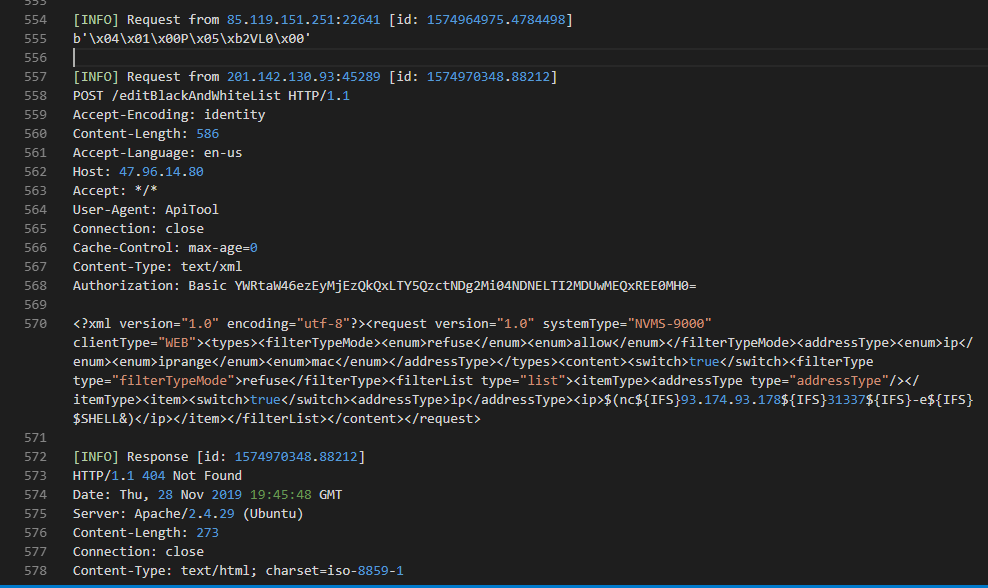
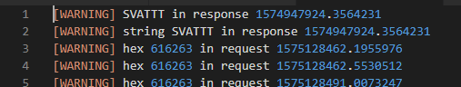

# simple-portforwarder
Simple portforwarder I prepared for SVATTT2019 final - an attack/defense style CTF.

## Features
- Listen on one port and forward traffic to another port on same host or other host.
- Run effectively and consume less computer resource.
- Read configs from json file.
- Log tcp data, ip, port source and timestamp.
- Can write rule to detect packet based on strings, hex values or regex. Detected packet can be dropped or the reponse can be modified.

## Config and run
Write configs in a json file for each port you want to forward.
```json
{
    "id": "web01",
    "local_port": "8080",
    "remote_host": "172.17.0.2",
    "remote_port": "80",
    "filter_request":{
        "string": [
            {
                "sign":"test",
                "action": 0
            }
        ],
        "hex": [
            {
                "sign": "616263",
                "action": 1
            }
        ],
        "regex": 
        [
            {
                "sign": "User-Agent:[ ]sqlmap",
                "action": 1
            }
        ]
    },
    "filter_response":{
        "string": 
        [
            {
                "sign": "SVATTT",
                "action" : "HTTP/1.1 400 Bad Request\r\nDate: Thu, 28 Nov 2019 12:52:08 GMT\r\nServer: Apache/2.4.29 (Ubuntu)\r\nContent-Length: 6\r\nConnection: close\r\nContent-Type: text/html; Charset=iso-8859-1\r\n\r\nconcac"
            }
        ],
        "hex": [],
        "regex": []
    }
}
```  
- id: Log will be write to {id}_access.log and {id}_filter.log
- local_port: Port u want to listen.
- remote_host: Host u want to forward to.
- remote_port: Port u want to forward to.
- filter_request: Rules u want. It includes string, hex, regex.
    - sign: signature
    - action: Action to do for packet matched the rule. 
        - 0: Just log to filter log.
        - 1: Drop packet.
        - Other string value: Response data u want to send.

Run it with:
``` bash
./portforwarder.py config1.json
```

# Result
Access log:
  

Filter log:
